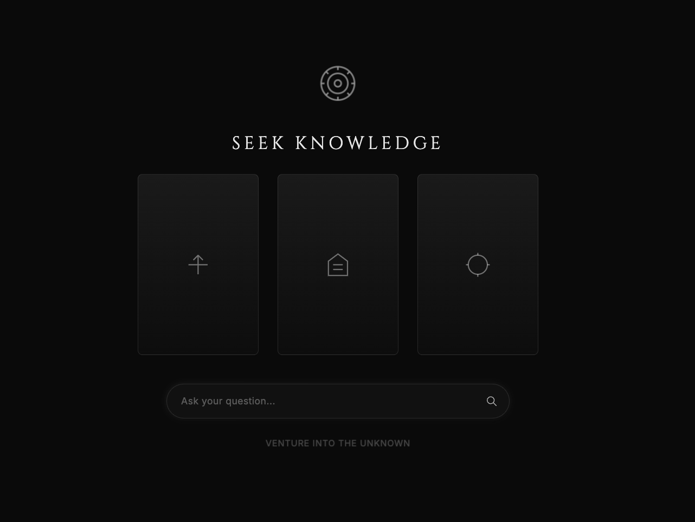
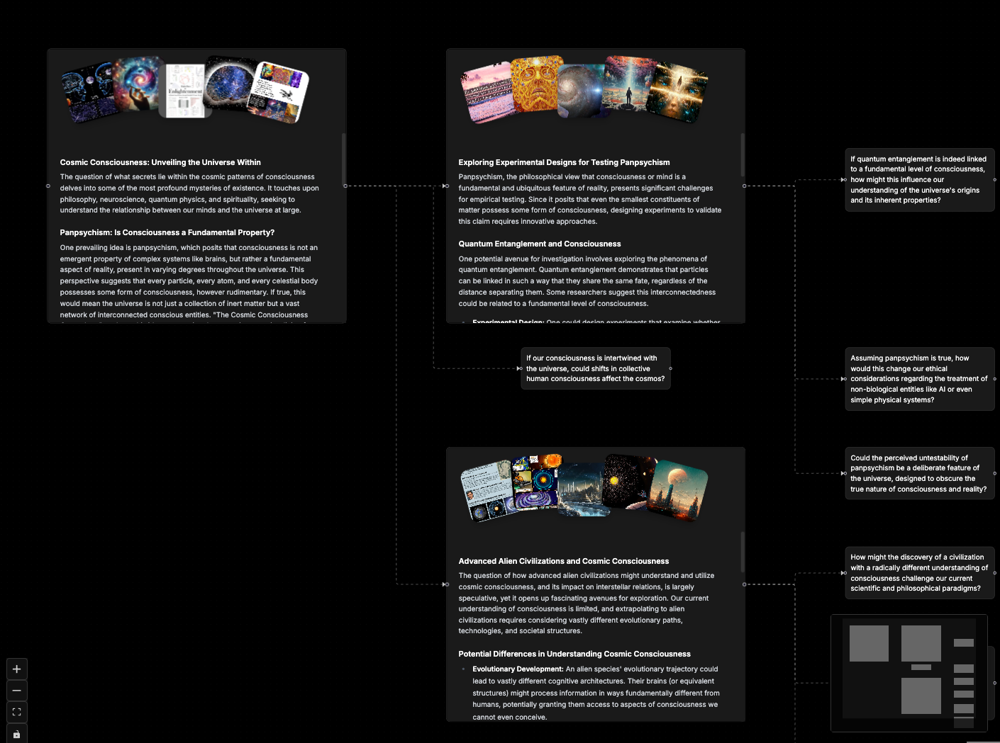
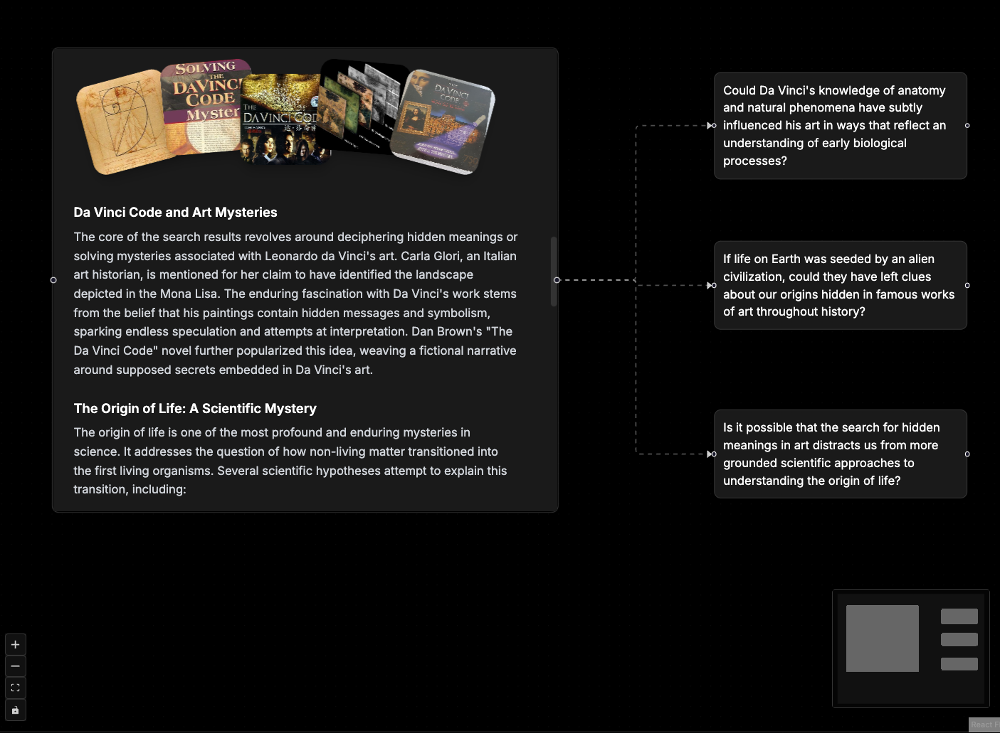

# Open RabbitHoles 🐰

[](https://buymeacoffee.com/sheing)

Introducing Open RabbitHoles - an open source implementation inspired by the original RabbitHoles app, but with our own twist. Dive deep into the rabbit holes without the premium price tag. This tool helps you dive deep into any topics, discover unexpected connections, and visualize your research journey in an interactive mind map.

Built with React, Node.js, and powered by a combination of Tavily and Google AI, this implementation offers a unique approach to mind map style exploration and knowledge mapping.

## Screenshots 📸


*The main interface showing the "SEEK KNOWLEDGE" header and search functionality*


*An example exploration map showing topics around cosmic consciousness, panpsychism, and quantum entanglement*


*Exploring connections between Da Vinci's work and scientific mysteries*

## Why Open RabbitHoles? 🤔

- 🆓 Free and open source alternative to premium research tools
- 🔄 Unique implementation combining multiple AI providers for better results
- 🎯 Custom-built visualization algorithms for knowledge mapping
- 🚀 Enhanced with Tavily's search capabilities
- 💡 Powered by Google Gemini for deeper insights

## Features 🚀

- Interactive mind-map style exploration
- AI-powered content generation and connections
- Beautiful, fluid UI with React Flow
- Real-time topic exploration and visualization
- Seamless backend integration with OpenAI

## Tech Stack 💻

### Frontend
- React
- TypeScript
- React Flow
- Tailwind CSS
- Dagre (for graph layouts)

### Backend
- Node.js
- Express
- TypeScript
- OpenAI API integration

## Architecture 🏗️
Potential production architecture for the project.

```mermaid
graph TD
    subgraph "Frontend Layer"
        UI[React UI]
        RF[React Flow Visualization]
        Store[State Management]
        UI --> RF
        UI <--> Store
        RF <--> Store
    end

    subgraph "Backend Core"
        direction TB
        API[Express API Gateway]
        Router[Dynamic Route Handler]
        Cache[In-Memory Response Cache]
        QP[Query Processor]
        CO[Conversation Orchestrator]
        
        API --> Router
        Router --> QP
        QP <--> Cache
        QP --> CO
    end

    subgraph "AI Service Layer"
        direction TB
        TO[Topic Orchestrator]
        subgraph "Search Services"
            TS[Tavily Search Engine]
            TC[Topic Contextualizer]
        end
        
        subgraph "AI Processing"
            GE[Gemini Engine]
            PP[Prompt Processor]
            KM[Knowledge Mapper]
        end
    end

    subgraph "Data Flow"
        Store <--> API
        Router <--> TO
        TO <--> TS
        TO <--> TC
        CO <--> PP
        PP <--> GE
        GE <--> KM
        KM --> TC
    end

    style Frontend Layer fill:#e1f5fe,stroke:#01579b
    style Backend Core fill:#e8f5e9,stroke:#2e7d32
    style AI Service Layer fill:#fce4ec,stroke:#c2185b
    style Data Flow fill:#fff3e0,stroke:#ef6c00
```

## Getting Started 🌟

### Prerequisites
- Node.js (v14 or higher)
- npm or yarn
- OpenAI API key

### Installation

1. Clone the repository
```bash
git clone https://github.com/AsyncFuncAI/rabbitholes.git
cd rabbitholes
```

2. Install dependencies
```bash
# Install root dependencies
npm install

# Install frontend dependencies
cd frontend
npm install

# Install backend dependencies
cd ../backend
npm install
```

3. Set up environment variables
```bash
# In backend/.env
PORT=3000
TAVILY_API_KEY= your_tavily_api_key
GOOGLE_AI_API_KEY= your_google_api_key
```

4. Start the development servers
```bash
# Start backend (from backend directory)
npm run dev

# Start frontend (from frontend directory)
npm start
```

## Usage 🎯
1. Open your browser and navigate to `http://localhost:3001`
2. Enter a topic you want to explore in the search bar
3. Watch as the AI generates connections and builds your exploration map
4. Click on nodes to dive deeper into subtopics
5. Save and share your exploration paths

## Contributing 🤝
Contributions are welcome! Please feel free to submit a Pull Request.

1. Fork the repository
2. Create your feature branch (`git checkout -b feature/AmazingFeature`)
3. Commit your changes (`git commit -m 'Add some AmazingFeature'`)
4. Push to the branch (`git push origin feature/AmazingFeature`)
5. Open a Pull Request

## License 📝
This project is licensed under the MIT License - see the [LICENSE](LICENSE) file for details.

## Credits 🙏

This project is powered by [Dojoma AI](https://dojoma.ai). Special thanks to team from Dojoma AI for contributing to this project.


---
Built with ❤️ 
